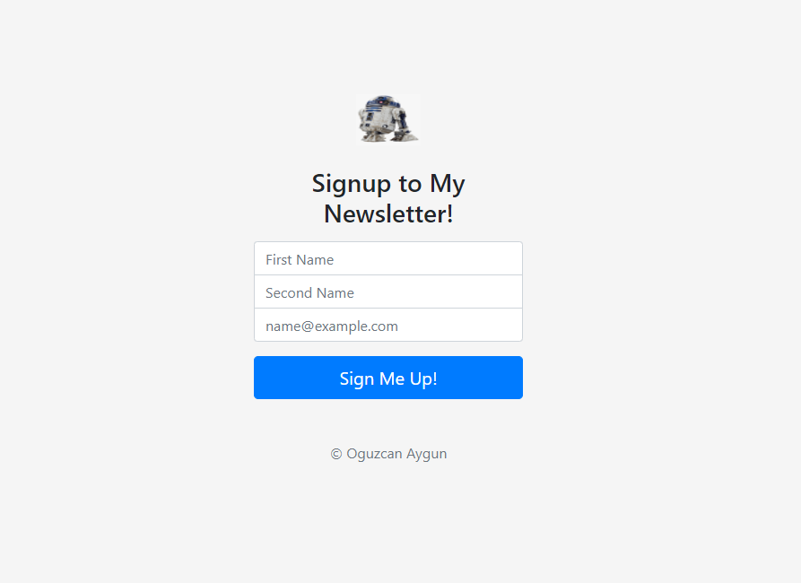

# Mail-Collector
LIVE:https://dry-citadel-14347.herokuapp.com/  

  

you can subscribe if you want Newsletter montly  
GENERETE YOUR OWN API KEY AND LIST ID FROM MAIMCHIMP REPLACE THEM INSIDE app.js file
you need to install express,body-parser,request npm modules (command:npm install express)
